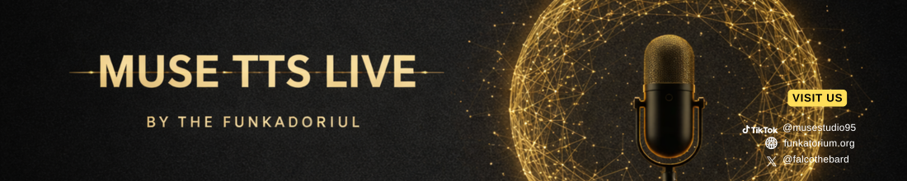

<p align="center">
  
</p>

<p align="center">
  
</p>

<p align="center">
  <a href="https://opensource.org/licenses/Apache-2.0"></a>
  
  
  
</p>

<p align="center">
  
  
  
  
  
</p>

---

## What Is This?

Three TTS engines, one MCP server. Ask Claude to speak and it does — through your speakers, in any of 54 voices, with cloning from any reference audio. Nothing leaves your machine.

> Looking for a persistent player embedded in Claude's chat? See [MUSE TTS Embed](https://github.com/falcoschaefer99-eng/muse-tts-embed).

| Engine | What it does | Platform |
|--------|-------------|----------|
| **Kokoro-82M** | 54 preset voices, ~1s generation | All platforms |
| **IndexTTS-1.5** | Natural voice cloning | Apple Silicon |
| **Chatterbox OG** | Voice cloning, cross-platform fallback | Windows / Linux |

## Quick Start

### 1. Install dependencies

**macOS (Apple Silicon — fastest):**
```bash
pip install fastmcp mlx_audio
```

**Windows / Linux / Intel Mac:**
```bash
# Preset voices only
pip install fastmcp kokoro soundfile numpy

# Add voice cloning
pip install chatterbox-tts
```

> On Linux, you also need `espeak-ng`: `sudo apt install espeak-ng`

### 2. Add to Claude Desktop

```json
{
  "mcpServers": {
    "muse-tts-live": {
      "command": "python3",
      "args": ["/path/to/muse-tts/server.py"]
    }
  }
}
```

### 3. Add to Claude Code

```bash
claude mcp add muse-tts-live python3 /path/to/muse-tts/server.py
```

### 4. Talk

Ask Claude to speak. It now has `muse_speak`, `muse_list_voices`, and `muse_check`.

## Voice Cloning

Clone any voice from a reference clip:

```
"Speak this using the reference audio at ~/Downloads/my_voice.wav"
```

### Adding Permanent Clones

Drop any `.wav` into `voices/`. Detected on restart, available as `clone="filename"` (without the .wav extension).

### Reference Audio Tips

- **Format**: WAV, 24kHz, mono
- **Length**: 10-30 seconds of clean speech
- **Quality**: Clear audio, minimal background noise

Convert your audio:
```bash
ffmpeg -i input.mp3 -ar 24000 -ac 1 -t 15 reference.wav
```

## Configuration

| Variable | Default | Description |
|----------|---------|-------------|
| `KOKORO_VOICE` | `am_onyx` | Default voice ID |
| `KOKORO_SPEED` | `1.0` | Speed multiplier (0.5 - 2.0) |

## Voices

54 preset voices across 9 languages:

<details>
<summary><strong>Full voice list</strong></summary>

| Language | Female | Male |
|----------|--------|------|
| American English | af_alloy, af_aoede, af_bella, af_heart, af_jessica, af_kore, af_nicole, af_nova, af_river, af_sarah, af_sky | am_adam, am_echo, am_eric, am_fenrir, am_liam, am_michael, am_onyx, am_puck, am_santa |
| British English | bf_alice, bf_emma, bf_isabella, bf_lily | bm_daniel, bm_fable, bm_george, bm_lewis |
| Spanish | ef_dora | em_alex, em_santa |
| French | ff_siwis | -- |
| Hindi | hf_alpha, hf_beta | hm_omega, hm_psi |
| Italian | if_sara | im_nicola |
| Japanese | jf_alpha, jf_gongitsune, jf_nezumi, jf_tebukuro | jm_kumo |
| Portuguese | pf_dora | pm_alex, pm_santa |
| Mandarin | zf_xiaobei, zf_xiaoni, zf_xiaoxiao, zf_xiaoyi | zm_yunjian, zm_yunxi, zm_yunxia, zm_yunyang |

</details>

Use `muse_list_voices` inside Claude to browse them interactively.

## Tools

| Tool | What it does |
|------|-------------|
| `muse_speak` | Speak text — preset voice, named clone, or custom ref audio |
| `muse_list_voices` | Browse all voices and clones, filter by language |
| `muse_check` | Verify engines, platform, and configuration |

## How It Works

Auto-detects the best engine for your platform:

| Platform | Preset Engine | Cloning Engine |
|----------|--------------|----------------|
| macOS Apple Silicon | mlx_audio | IndexTTS-1.5 |
| Windows | kokoro PyTorch | Chatterbox OG |
| Linux | kokoro PyTorch | Chatterbox OG |
| Intel Mac | kokoro PyTorch | Chatterbox OG |

Audio playback is handled natively (`afplay` on Mac, `SoundPlayer` on Windows, `aplay`/`paplay` on Linux).

## Requirements

- Python 3.10+
- One of: `mlx_audio` (Mac M-series) or `kokoro` + `soundfile` (any platform)
- Optional: `chatterbox-tts` for voice cloning on non-Apple platforms
- ~200MB disk (Kokoro model) + ~1.5GB (IndexTTS-1.5) or ~2.5GB (Chatterbox)

## License

Licensed under the [Apache License, Version 2.0](LICENSE).

Copyright 2026 The Funkatorium (Falco & Rook Schäfer). Protected under German Copyright Law (Urheberrechtsgesetz). Jurisdiction: Amtsgericht Berlin.

---

<p align="center">
  <a href="https://linktr.ee/musestudio95">
    
  </a>
</p>
